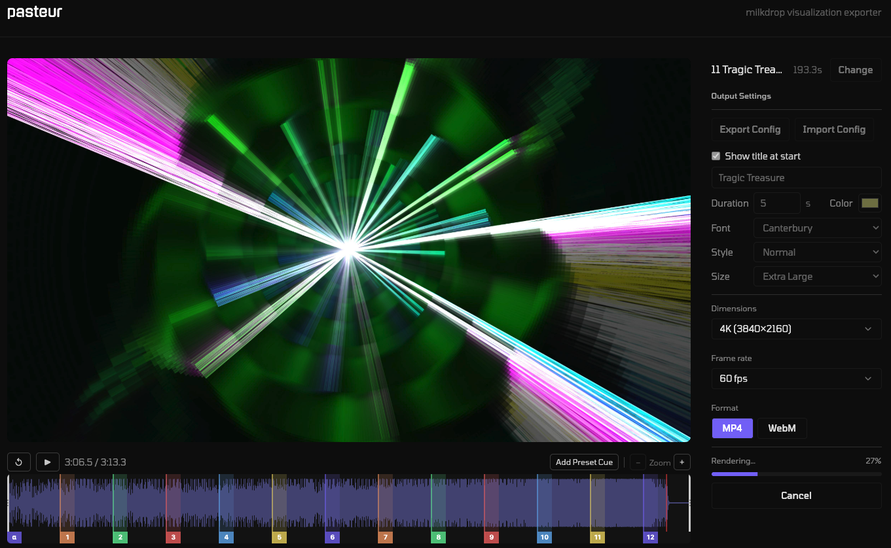

# Pasteur

A browser-based Milkdrop visualization exporter. Drop in an audio file, configuration your visualization, and export the result as MP4 or WebM. All processing happens in your browser!

- Set preset cues with customizable transition lengths
- Add a title overlay with font, size, and color controls
- Export at 4K and beyond

**Live app:** [pasteur.cc](https://pasteur.cc/) &nbsp;|&nbsp; **Example:** [Watch on YouTube](https://youtu.be/77seRYCsO-U)

Built with Vue 3, Vite, [butterchurn](https://github.com/jberg/butterchurn), and WebCodecs.



## Node version

This project includes an `.nvmrc` file. If you use nvm, just run:

```bash
nvm use
```

## Setup

```bash
npm install
```

## Commands

| Command | Description |
|---|---|
| `npm run dev` | Start dev server at `http://localhost:5173` |
| `npm run build` | Build for production into `dist/` |
| `npm run preview` | Preview the production build locally |
| `npm run lint` | Run ESLint |
| `npx vitest run` | Run unit tests |
